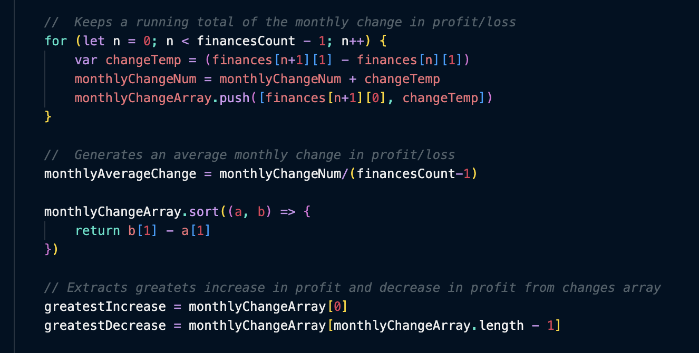

# Console-Finances

## Description

For our introduction to JavaScript, we were given an array of data and asked to iterate over the array to print to the console a number of statistics about the data set. This involved calculating changes in profits between each month in the array, pulling out the largest increase and decrease in profits, calucating the average change between months and finding the total profit of the whole dataset.

## Further Learning

After I had finished the mathematics and printed all the required outputs to the console I started learning how to integrate the JS variables with HTML and CSS. I researched using element ID's and innerHTML to send the values in the variables to be displayed on the HTML page.

